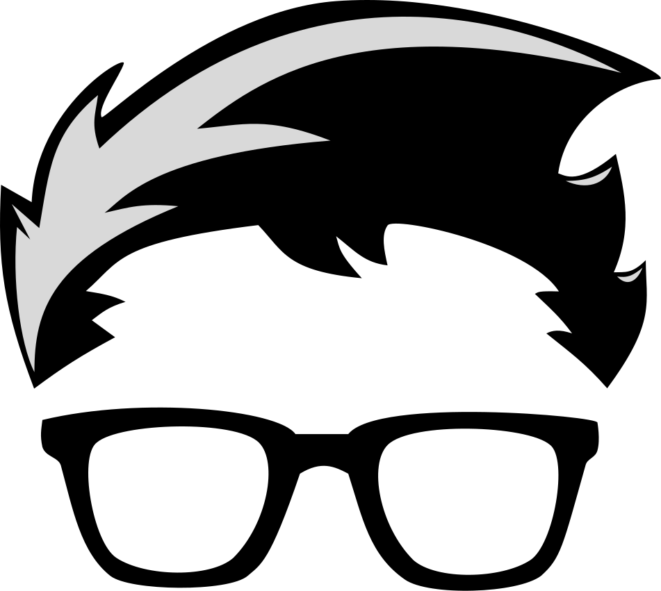

<p align="center">
  
</p>

<h1 align="center">gaya kaci — portfolio</h1>

<p align="center">
   <strong>Minimalist developer portfolio. Terminal-inspired, black & white.</strong><br>
   <em>Built with Next.js 16 and Tailwind CSS 4.</em>
</p>

## Features

- Single-page scroll layout with anchor navigation
- Terminal-inspired UI with prompt aesthetics
- Blinking cursor and scroll-triggered fade-in animations
- 9 featured open-source projects
- Categorized skills from security to AI/ML
- Fully responsive and keyboard-accessible
- Self-hosted JetBrains Nerd Font

## Tech Stack

- **Framework:** Next.js 16
- **UI:** React 19, Tailwind CSS 4
- **Icons:** Lucide React
- **Font:** JetBrains Nerd Font (self-hosted via `next/font/local`)
- **Language:** TypeScript
- **Package Manager:** Bun

## Getting Started

### Prerequisites

- Node.js 20+ or Bun

### Installation

```bash
bun install
# or
npm install
```

### Development

```bash
bun dev
# or
npm run dev
```

Open [http://localhost:3000](http://localhost:3000) to view the app.

### Project Structure

```
app/            # Next.js App Router pages, layout, fonts and global styles
components/     # Reusable UI components (Nav, Caret, Reveal, icons)
sections/       # Page sections (Hero, About, Projects, Skills, Contact)
lib/            # Static data (projects, socials)
public/         # Logo SVGs and self-hosted font files
```
